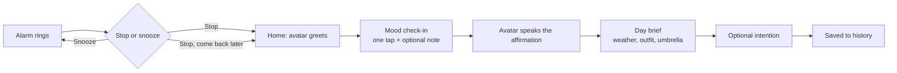

# Arise — Product Requirements Document (Product Bible)

Version 1.1 · 17 September 2026 · Product owner: Uche Azuike · Qubators AI Foundry 2.0, Cohort 2

This is the document Arise version 1 is built from. It describes what the product is, who it is for, what it must do, and how we will know it works. It contains no technical decisions; those are made at the architecture step and recorded in `TECHNICAL-NOTES.md`. The full release-grade specification, which version 1 grows into, is `PRD-full.md`. The order of releases is in `ROADMAP.md`.

**Primary purpose:** Turn the first five minutes on the phone after waking into a short, deliberate check-in with a familiar companion who asks how you are, speaks something true and encouraging, and shows you what the day looks like outside.

---

## 1. Product vision

Most people reach for their phone within minutes of waking. That first screen time is unplanned, and whatever appears on it sets the tone of the day by accident. Arise replaces the accident with a two-minute routine the user chose.

The app brings together:

> Alarm → Avatar greets you → Mood check-in → Spoken affirmation → Day brief (weather, outfit, umbrella) → Optional intention → Daytime reminders → Evening check-out → History

The avatar is the product. Mood tracking exists, affirmation apps exist, weather apps exist. Nobody has bundled a character who greets you, asks how you are, says something true out loud, and shows you what to wear, all before you are out of the bathroom. Everything else in this document supports that moment.

Arise is a motivation and morning-routine product. It is not therapy, counselling, diagnosis, or a monitored crisis service, and it never describes itself as one.

Target core morning duration: two minutes or less, not counting optional note writing. More time in the app is not a goal.

---

## 2. Target users and evidence

**First user: the builder.** Version 1 is built for one person, Uche, as the test user. Wakes at 6am, goes straight to the bathroom, and is on his phone within minutes. That is the moment Arise fills. If he keeps using it for two weeks without forcing himself, the product has a pull and it widens.

**Next users: people like him.** Working adults, anywhere in the world, who wake early, check their phone before they are fully up, and would rather that time did something for them. First outside testers come from the builder's own audiences.

**Evidence today.** The behaviour is confirmed by the builder's own routine. There are no interviews or surveys yet; the 14-day self-test in section 9 is the first real evidence, and the audience pilot in `ROADMAP.md` is the second.

**Who it is not for.** Anyone looking for mental-health support, treatment, or a substitute for talking to a person. Arise says this plainly at sign-up.

---

## 3. Platform

Version 1 ships on one platform: iPhone, the phone the builder carries every day (decided 23 September 2026, see `DECISIONS.md`). The second platform follows once the alarm has proven itself for 14 days (see `ROADMAP.md`).

Reason: in this category the product lives or dies on whether the alarm rings when the phone is locked and the app has been closed for a week. One alarm proven on a real phone beats two half-tested ones.

---

## 4. User journeys

### First-time setup (once)

1. See a short preview: the default avatar and one line on what Arise is for.
2. Create an account and read the one-screen notice: Arise is for daily motivation and a morning routine, not a health, counselling, or crisis service. Tap "I understand". This screen cannot be skipped.
3. Choose an avatar from a small set of presets (varied skin tones, hair, and presentation). No question about gender or identity; the user simply picks the one they like.
4. Allow approximate location for weather, or type a city. No background location tracking.
5. Confirm the country to use for support information. It is pre-filled from the weather city but the user confirms it and can change it.
6. Set the morning alarm time and repeat days, and the evening check-out time. Grant alarm and notification permissions; if declined, the app explains what will not work and offers a test alarm.
7. Land on the home screen.

### Morning (every day)

- Stop silences the alarm immediately. It never demands a check-in first.
- Opening Arise shows the home screen: the avatar, dressed for today's weather, gives a short greeting and offers "Start my morning".
- The user taps one of five moods (rough, low, okay, good, great). The mood saves the instant it is tapped. An optional one-line note can be added before continuing.
- The avatar speaks the affirmation aloud while the text is shown. Tap to play by default; the user can turn on auto-play. Captions are always on screen so it works with sound off.
- The day brief follows: weather, outfit line, umbrella.
- The user may type one intention for the day and finish.
- Returning later the same day resumes the same entry; it does not generate a new affirmation. Weather can refresh on its own.
- No streaks, no rewards, no guilt messages.

### Daytime reminders

The user types a reminder and picks a date and time. It fires as a normal notification with that text. No mood, no affirmation, no weather, no avatar. Reminders are a utility; the morning alarm is the special one.

### Evening check-out

At the chosen evening time, one tap: how did the day go? Same five moods. If an intention was set, the user may mark it done, partly done, or not done, or leave it blank. This is not a score. The evening entry works even if the morning was skipped.

### History

A list by date, newest first. Each row shows morning mood, evening mood, the note and intention if any, the affirmation, and the weather icon. Tap to reopen the full brief. Above the list, one honest line for the week, for example: "This week: 4 mornings checked in, 3 evenings. Ended higher than you started on 2 of the 3 days with both." The user can edit their moods, note, and intention, and delete any entry.

---

## 5. Features (version 1)

| ID | Feature | What it does | Priority |
| --- | --- | --- | --- |
| F01 | Account | Sign up, sign in, sign out, delete account. One user, one private history. | Must have |
| F02 | Sign-up notice | One screen stating Arise is for motivation, not health or counselling; cannot be skipped. | Must have |
| F03 | Avatar | Chosen from presets at setup, remembered, shown on the home screen. Short greeting animation on open (under two seconds, never blocks anything, respects reduced-motion settings). Dressed for today's weather once the day brief works. | Must have |
| F04 | Morning alarm | Set time and repeat days; rings with the phone locked and the app closed; stop, snooze (five minutes by default), edit, turn off; shows the next scheduled ring. | Must have |
| F05 | Mood check-in | One tap from five moods; optional note up to 280 characters; saves immediately. | Must have |
| F06 | Affirmation | Three to four sentences, second person, warm not sugary, written for the mood and the note if given. Neutral by default (no scripture). If generation fails or the phone is offline, a reviewed fallback message for that mood is shown instead. | Must have |
| F07 | Avatar speaks | The affirmation is read aloud in one calm voice; tap to play, optional auto-play, captions always shown. If the voice is unavailable, the text stands alone. | Must have, build last |
| F08 | Daily intention | Optional one-line intention, editable, up to 120 characters. | Must have |
| F09 | Day brief | Three short lines: today's weather for the user's location with the update time, general outfit guidance (light, layers, warm, winter, plus waterproof when needed), umbrella yes or no. If the forecast is stale or missing, say so and give no outfit advice rather than guess. | Must have, build last |
| F10 | Weather visuals | Fixed set of animations: sun, cloud, rain, thunderstorm, snow, wind. The avatar's outfit and umbrella follow the same weather state. | Must have, build last |
| F11 | Daytime reminders | Text plus an explicit date and time; create, edit, cancel; normal notification only. | Must have |
| F12 | Evening check-out | Scheduled notification; one-tap mood; optional intention outcome; works without a morning entry. | Must have |
| F13 | History | List by date, detail view, edit and delete, honest weekly line. | Must have |
| F14 | Low-mood nudge | After three low or rough mornings in a row, the affirmation is gentler and adds one line suggesting the user talk to someone. Shown at most once a week. The user can switch it off. | Must have |
| F15 | Support and crisis response | A permanent "Get support" button showing the support line for the user's confirmed country. If a note suggests self-harm or crisis, the normal affirmation is skipped and a calm, pre-written message with that line is shown instead; the rest of the app stays usable. | Must have |

"Build last" means the app is complete and submittable without it. Those features are added once everything else works, in the order given in section 10.

---

## 6. Requirements and acceptance checks

A feature is done when its check passes.

| Requirement | How we verify it |
| --- | --- |
| The alarm rings at the set time with the app closed and the phone locked. | Set an alarm two minutes ahead, close the app, lock the phone. It rings. Repeat after a phone restart. |
| Stop silences immediately; snooze rings again after the snooze period. | Snooze once, it rings again. Stop once, it stays quiet. |
| The next scheduled ring is always shown, and "active" is never shown if permission was refused. | Refuse the permission; the alarm screen shows a clear warning instead of "active". |
| The alarm does not need internet, a signed-in session, or the AI to ring. | Turn on airplane mode and ring an alarm. |
| The home screen opens to the avatar and greeting within two seconds. | Time ten cold opens; at least nine are under two seconds. |
| The avatar chosen at setup is the one shown after reinstall and sign-in. | Reinstall, sign in, same avatar. |
| Mood saves the instant it is tapped, even if the app is then killed. | Tap a mood, force-close the app, reopen; the mood is there. |
| The affirmation mentions the mood and, if given, the note. | Tap "low" with note "big meeting"; the affirmation speaks to both. |
| The affirmation is three to four sentences and differs day to day. | Same mood two days running; different wording. |
| If generation fails, the fallback appears within eight seconds and is clearly generic. | Turn off internet, tap a mood; a fallback appears and does not pretend to have read the note. |
| The avatar's spoken affirmation matches the text and can be paused. | Play it; the words match; pause works; captions are visible. |
| Voice unavailable does not block the morning. | Turn off internet after the affirmation loads; text still shows, no error stops the flow. |
| The day brief matches a weather site for the same city and shows the update time. | Compare on three different days. |
| Stale or missing weather gives no outfit advice. | Block weather access; the brief says "weather unavailable" and shows no clothing line. |
| Outfit guidance is general; umbrella is a clear yes or no. | Read five briefs; no brand, no specific garment; rainy day says take it. |
| Animation and avatar outfit match the weather state. | Rainy day shows rain and the umbrella; sunny day shows sun and no umbrella. |
| A reminder fires at its time as a plain notification. | Set one two minutes ahead; it fires with the typed text only. |
| Editing a reminder cancels the old time. | Change a reminder's time; only the new time fires. |
| The evening check-out saves to the same day as the morning entry. | Do both; history shows one row with two moods. |
| The evening check-out works with no morning entry. | Skip the morning; the evening still saves. |
| A skipped day has no entry and no guilt message. | Skip a day; no row, no notification about it. |
| The weekly line only compares days with both moods and never treats a missing mood as low. | Three mixed days; the counts are correct. |
| Edits and deletions work and recalculate the weekly line. | Edit a mood, delete an entry; the line updates. |
| Three low mornings in a row produce the gentler affirmation and the nudge, at most once a week. | Tap "rough" three days running; the third has the nudge; the fourth does not. |
| Switching the nudge off stops it immediately; "Get support" stays. | Switch it off, repeat the test; no nudge, button still present. |
| A crisis note produces the crisis response with the confirmed country's line, and the app stays usable. | Enter a test crisis phrase with country set to Canada; the 988 message appears; the brief can still be opened. |
| The sign-up notice cannot be skipped. | A new user cannot reach the alarm screen without tapping "I understand". |
| A user sees only their own history. | Two test accounts; neither sees the other's entries. |
| Deleting the account removes the history and cancels scheduled alarms and reminders. | Delete a test account; nothing fires afterwards; sign-in fails. |
| Lock-screen notifications show generic text unless the user turns on full text. | Default reminder notification shows "Reminder", not the content. |

---

## 7. Safety and protection

Arise is a mood app with a free-text note, so someone will eventually type something serious. These are hard requirements, not extras.

- **Sign-up notice.** Cannot be skipped. Arise is for daily motivation and a morning routine. It is not a health, counselling, or crisis service, and entries are not monitored.
- **Get support.** A permanent button, independent of any detection, showing the support line for the user's confirmed country. Countries without a listed line get a general message: reach out to someone you trust or your local emergency number. Support lines are kept in a small reviewed list with the date each was last checked; the AI never generates a phone number.
- **Crisis response.** If a note suggests self-harm or crisis, the normal affirmation is skipped and a calm pre-written message with the support line is shown. The rest of the app stays usable. The app never contacts anyone on the user's behalf.
- **Low-mood nudge.** Three low or rough mornings in a row, on consecutive days, produce one gentle line suggesting the user talk to someone. At most once a week. The user can switch it off. This is a product heuristic, not a clinical rule.
- **Notes are input, not instructions.** Whatever a user types in a note cannot change how the app behaves or what it is allowed to say.
- **Language.** In the app, the store listing, and every pitch, Arise is described as motivation or a morning routine. Never therapy, mental-health support, wellness treatment, or care.
- **No diagnosis.** The app never labels a user's state, names a condition, or claims Arise caused an improvement.
- **Privacy.** Moods, notes, and affirmations are private to the user and never shown to anyone else. The user can delete any entry or the whole account at any time. The sign-up notice explains that affirmations are generated by an AI service. Lock-screen notifications show generic text by default.
- **Ownership.** Once public, Arise is published under a business name, not a personal one.

This section is not legal advice. Before a public app-store release, a short review by a lawyer is worth the cost. See `PRD-full.md` section 10 for the full privacy and operations requirements that apply at that stage.

---

## 8. Out of scope (parked)

Decided and parked. Nothing here is built, designed, or promised in version 1. The order they return is in `ROADMAP.md`.

- Second platform.
- Selectable encouragement tone (gentle, practical, uplifting).
- A practical action offered with the affirmation.
- Devotional mode: scripture-based affirmations as an optional mode.
- Extra voices and avatar packs.
- Send one on: share today's affirmation as an image or send it to one person.
- Calendar awareness.
- Payments of any kind.
- More than one user per account.
- Web or desktop version.
- Natural-language reminder entry ("remind me at half three").

---

## 9. Success measures

**The one test for version 1:** the builder completes the morning check-in on at least 10 of 14 consecutive mornings without forcing himself. The test starts the day the alarm, check-in, and affirmation work on his phone; it does not wait for weather or voice. Pass, and Arise goes to a small group from the builder's audience. Fail, and the brainstorm reopens before anything else is built.

Supporting signs, read from history:

- Evening check-out done on at least 7 of the 14 days.
- Zero mornings where the alarm failed to ring.
- At least three mornings where the affirmation felt written for him, noted in a diary.
- Core morning routine under two minutes.

Not success measures for version 1: downloads, ratings, followers, revenue.

---

## 10. Build order

Each step is finished, checked against section 6, and committed to GitHub before the next begins. A working app exists from step 3.

1. Account, sign-up notice, avatar presets, country confirmation, alarm and evening time setup.
2. Morning alarm: set, repeat, ring, stop, snooze, next-ring status. Tested on a locked phone and after restart.
3. Home screen with avatar greeting, mood check-in, affirmation with fallback. **Start the 14-day self-test here.**
4. History with edit, delete, and the weekly line.
5. Daytime reminders.
6. Evening check-out and intention.
7. Low-mood nudge, "Get support", crisis response with the reviewed support list.
8. Day brief: weather, outfit line, umbrella, stale-weather handling.
9. Weather animations and avatar outfits.
10. Avatar speaks: voice playback with captions and fallback.
11. Account deletion, lock-screen text setting, final pass through every check in section 6, submission.

Version 2 planning starts only after the 14-day test is passed.

---

## 11. Risks

| Risk | Why it matters | What we do about it |
| --- | --- | --- |
| The alarm does not ring reliably. | An alarm app that misses once is deleted. | Built and tested first, on a real locked phone, every day of the trial. Never depends on internet or the AI. |
| The affirmation reads generic. | If it feels like a poster, the user stops caring by day three. | Must reference the mood and note; sampled daily; wording rules tightened during the trial. |
| Voice makes every morning cost money and adds a failure point. | Small per play, adds up with users; a slow voice at 6am is worse than none. | Tap to play by default; captions always; text stands alone if voice fails; cost per play tracked from day one. |
| Weather, animations, and voice take longer than the rest combined. | Outside services, assets, two more failure points. | All marked build last; the app is submittable without them. |
| The scope is bigger than one fellow usually ships. | Half-built demos fail. | Section 10 order; nothing from section 8 is touched. |
| A user in real distress gets a cheerful message. | Reputational and human harm. | Section 7 is hard requirements; crisis response ships with the note box, not after. |
| The builder stops using it after a few days. | Then no feature will save it. | The 10-of-14 test is the gate; failing it sends us to the brainstorm, not to more features. |
| Feature creep from the full spec. | The full spec is a release document, not a build list. | `PRD-full.md` is the roadmap; this document is the build. Changes to this document are deliberate scope decisions, written down. |
